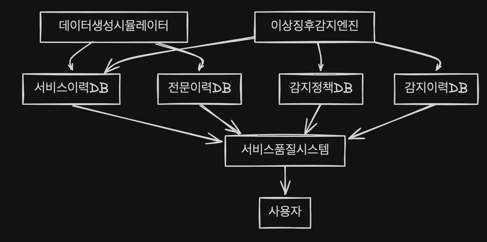

# 한국투자 디지털혁신 경진대회 프로젝트 소개

이 프로젝트는 IT 서비스 품질 관리 시스템으로 **금융 서비스 이상 징후 감지 모니터링 및 관리를 위한 솔루션**입니다. \
개요, 주요기능, 기술스택, 프로젝트 구조, 프론트엔드 개발 및 배포 가이드, 서버 개발 및 배포 가이드, 팀 소개 및 역할로 구성되어 있습니다.


## 1. 프로젝트 개요

이 프로젝트는 기존 IT 시스템의 모니터링 문제점과 한계를 해결하기 위해 시작되었습니다. \
실시간 거래 분석, 오류탐지, 탐지 규칙 설정 등 다양한 기능을 제공하여 IT 금융 서비스의 안전성을 높여 \
<u>**전자금융사고 예방을 강화하고 금융소비자 보호 수준을 개선하는 것을 목표로 합니다.**</u>

## 2. 시스템 구조
- 시뮬레이터는 실시간 거래 발생을 위한 기능입니다.(다양한 시스템의 거래 수집 대체) \


## 3. 주요 기능

1. 실시간 서비스 모니터링 분석
   - 실시간 거래 발생을 위한 시뮬레이터 기능(On/Off)
   - 거래량, 분당 거래량, 오류율, 평균 응답 시간 등의 실시간 통계 제공
   - D3.js와 ECharts를 활용한 실시간 거래 시각화
   - 오류 및 이상 거래 탐지 및 알림 기능

2. 서비스 이상 감지 목록

   - 날짜, 규칙 ID, 감지 상태 등 다양한 조건으로 이상 감지 목록 조회
   - 감지된 이상 항목의 상세 정보 확인 기능
   - 선택한 항목의 상태 일괄 변경 기능 (확인전, 확인중, 조치중, 모니터링중, 완료)
   - 서비스 ID, 서비스명, 규칙 ID, 규칙명, 거래증감율, 오류증감율, 감지시간 등 상세 정보 제공

3. 감지 규칙 설정 및 관리
   - 거래 모니터링을 위한 규칙 생성 및 편집
   - 다양한 조건 설정 (거래량, 오류율, 응답시간, 반복수행 등)
   - 규칙 활성화/비활성화 기능

4. 서비스 및 전문 내역 조회
   - 서비스(전문)명, 거래량, 오류율, 응답시간 등 다양한 조건으로 서비스 내역 조회
   - 서비스 및 전문 상세 내역 확인 기능

5. 사용자 관리

   - 사용자 등록, 수정 기능
   - 로그인 및 권한 관리

6. API 목록 및 관리

   - 다양한 API 엔드포인트 정보 제공, cURL 명령어 자동 생성
   - API 호출 테스트 기능
   - 응답 데이터 시각화 및 포맷팅

7. 서비스 테스트 센터
   - 모바일 뱅킹 간편이체, 대출신청, 토스 비교금리 테스트 기능


## 4. 기술 스택

### 4.1 Frontend

- Vue.js : 프론트엔드 프레임워크
- Vuetify : UI 컴포넌트 라이브러리
- D3.js: 데이터 시각화
- ECharts: 고급 차트 및 그래프 생성

### 4.2 Backend

- Spring boot: 자바 기반의 웹 애플리케이션 개발을 위한 프레임워크
- Spring Security: 인증 및 권한 부여를 위한 보안 프레임워크
- Spring Data JPA: 데이터베이스 접근을 위한 ORM 기술


## 5. 프로젝트 구조

### 5.1 프론트엔드 구조

- `index.html` : 이 파일은 전체 구조와 동작을 결정하는 설정들을 포함합니다. 웹 프로젝트 진입점으로, 주요 스크립트와 스타일시트를 로드합니다. \
Vue.js 를 초기화하고 라우팅 설정, Vuetify 테마 구성을 포함합니다. 
  - 라우팅 구성: 각 페이지 컴포넌트에 대한 경로 및 화면명, 아이콘 등 메타 정보 정의
  - Vuetify 테마 설정: 라이트/다크 모드 및 커스텀 색상 테마 정의
  - 전역 설정: API 엔드포인트 URL, 버튼 색상 등 전역 변수 설정
  - Axios를 이용한 HTTP 요청 헬퍼 함수 정의
- `vue/App.vue`: 메인 컴포넌트로, 전체 레이아웃과 네비게이션을 관리합니다. 알림 목록 관리, 다크/라이트 테마 전환, 글로벌 변수, 화면 스타일 등 애플리케이션 전반의 기능을 제어합니다.
- `vue/page/`: 주요 페이지 컴포넌트 포함

  - `p0-login.vue`: 로그인 페이지
  - `p1-live-transaction-analytics.vue`: 실시간 서비스 모니터링 페이지
  - `p8-rule-detected-list.vue`: 서비스 이상 감지 목록 페이지
  - `p3-rule-configuration.vue`: 이상 징후 감지 정책 설정 페이지
  - `p2-incident-dashboard.vue`: 서비스 내역 페이지
  - `p7-tx-history.vue`: 전문 상세 내역 페이지
  - `p9-service-manager.vue`: 서비스 관리 페이지
  - `p6-user-management.vue`: 사용자 관리 페이지
  - `p5-api-list.vue`: API 목록 및 테스트 페이지
  - `p20-readme-viewer.vue`: 프로젝트 설명 페이지
- `vue/page/test/`: 서비스 테스트 센터 페이지
  - `p11-mobile-banking-transfer.vue`: 모바일 뱅킹 간편이체 페이지
  - `p12-mobile-banking-loan.vue`: 모바일 뱅킹 대출 페이지
  - `p13-toss-loan.vue`: 토스 비교금리 페이지

### 5.2 서버 구조

- `src/main/java/com/ki/sqm/`: 서버 소스 폴더

## 6. 프론트 엔드 개발 및 배포 가이드

### 6.1 개발 환경 설정

1. 프로젝트 클론:

   ```
   git clone https://gitlab.com/hj.na/ki-project-fe
   ```

   (Git은 코드 버전 관리 시스템입니다.)
2. 웹 환경 구성:

   - Node.js 설치: https://nodejs.org/ 에서 다운로드 및 설치
     (Node.js는 자바스크립트 실행 환경입니다.)
   - live-server 설치:
     ```
     npm install -g live-server
     ```

     (npm은 Node.js의 패키지 관리자, live-server는 로컬 개발 서버입니다.)

### 6.2 프로젝트 실행

1. 프로젝트 폴더로 이동
2. 다음 명령어로 서버 실행:
   ```
   live-server --port=5500
   ```
3. 브라우저에서 http://127.0.0.1:5500 접속, 해당 주소가 아니면 서버 통신 불가(CORS 문제)


### 6.3 배포 프로세스

- GitLab에 코드를 push하면 자동으로 Netlify*에 배포됩니다.
- **Netlify**: 프론트엔드 웹사이트의 빌드, 배포 및 호스팅을 자동화하는 플랫폼입니다.
- 배포 사이트: https://ki-sqm.netlify.app/


## 7. 서버 개발 및 배포 가이드

### 7.1 프로젝트 환경

- 언어: Java(JDK 17)
- 프레임워크: Spring Boot
- 빌드 도구: Gradle
- 데이터베이스: MySQL 또는 MariaDB (선택)
- 캐싱: Spring Cache


- DB Container 실행
  - MariaDB 컨테이너 실행
      ```   
      sudo docker run -d \
      --name kkk \
      -p 53306:3306 \
      -v ./data:/var/lib/mysql \
      -v /etc/localtime:/etc/localtime:ro \
      -e MARIADB_ROOT_PASSWORD=패스워드 \
      ```
  - 컨테이너 목록 확인
      ```
      sudo docker ps
      ```

### 7.2 서버 프로그램 목록

- 실시간 서비스 모니터링 및 서비스, 전문 관련 API
  - `/getMetric`	실시간 서비스 모니터링 메트릭 정보 조회
  - `/gettxdata`	전문 상세 내역 조회
  - `/getGuidData`	GUID 별 전문 상세 내역 조회
  - `/incident`	서비스 내역 조회
- 이상 감지 관련 API
  - `/rule-detections`	이상 감지 목록 조회
  - `/rule-detect-update`	이상 감지 목록 상태 업데이트
  - `/rule-list`	감지 룰 목록 조회
  - `/rule-save`	감지 룰 등록
- 사용자 관련 API
  - `/user-list`	사용자 목록 조회
  - `/login-check`	사용자 상태 체크
  - `/login-signin`	사용자 로그인
  - `/login-signup`	사용자 등록
- 시뮬레이터 관련 API
  - `/simulator/off`	시뮬레이터 OFF
  - `/simulator/on`	시뮬레이터 ON
  - `/simulator/status`	시뮬레이터 상태 조회
- 서비스 테스트 센터 관련 API
  - `/loan-apply`	서비스 테스트 센터 - 비교 금리
  - `/loan-limit`	서비스 테스트 센터 - 대출신청
  - `/transfer`	서비스 테스트 센터 - 간편이체

&nbsp;
&nbsp;

## 8. 팀 소개 및 역할

- 프로젝트 기획 및 문서 작성 : IT전략기획팀 한경록(driver989@naver.com)
- 화면 기획 및 프론트엔드 개발 : IT개발팀 나형주(nhj7@naver.com)
- 서버 개발 및 데이터 모델링 : IT전략기획팀 이민호

